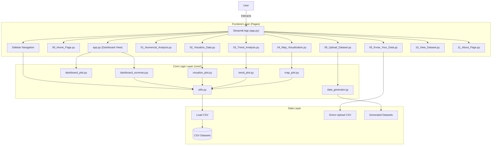
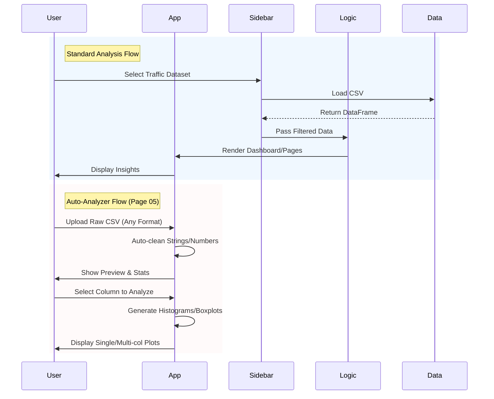

# 📘 Project Blueprint: Smart Traffic Violation Pattern Detector Dashboard

## 1. Project Overview

The **Smart Traffic Violation Pattern Detector Dashboard** is a comprehensive, data-driven web application designed to analyze, visualize, and report on traffic violation patterns. It serves as a tool for traffic authorities, city planners, and data analysts to:

- **Monitor** real-time or historical traffic violation data.
- **Identify** high-risk zones, recurring offender behaviors, and peak violation times.
- **Analyze** the correlation between environmental factors (weather, road conditions) and violations.
- **Track** fine generation, payment status, and revenue trends.

Built with **Streamlit**, the application offers a responsive and interactive interface for exploring complex datasets without requiring deep technical expertise.

## 2. Technology Stack

| Category | Technologies |
| :--- | :--- |
| **Frontend/UI** | [Streamlit](https://streamlit.io/) |
| **Backend Logic** | Python 3.x |
| **Data Processing** | [Pandas](https://pandas.pydata.org/), NumPy |
| **Visualization** | [Matplotlib](https://matplotlib.org/), [Seaborn](https://seaborn.pydata.org/), [Folium](https://python-visualization.github.io/folium/) |
| **Mapping** | Streamlit-Folium, GeoJSON |
| **Package Management** | `uv` (Recommended), `pip` |

## 3. High-Level Architecture

The application follows a modular architecture where `app.py` serves as the entry point, orchestrating navigation between different pages. Core business logic, data processing, and plotting functions are decoupled into the `core/` directory to ensure maintainability and reusability.



## 4. Directory Structure & Components

The project is organized to separate concerns between UI (Pages), Logic (Core), and Data.

```text
.
├── app.py                          # Application Entry Point & Dashboard View
├── core/                           # Core Business Logic & Utilities
│   ├── dashboard_plot.py           # Plotting functions for the main dashboard
│   ├── dashboard_summary.py        # Metric calculations for the main dashboard
│   ├── data_generator.py           # Logic for generating synthetic traffic datasets
│   ├── data_variables.py           # Constants, mappings, and lists for data generation
│   ├── map_plot.py                 # Folium map rendering logic
│   ├── sidebar.py                  # Sidebar UI & Dataset Selection Logic
│   ├── trend_plot.py               # Plotting functions for Trend Analysis page
│   ├── utils.py                    # Data loading, cleaning, filtering, and quality analysis
│   └── visualize_plot.py           # Plotting functions for Visualization page
├── pages/                          # Individual Application Pages
│   ├── 00_Home_Page.py             # Landing Page with Marquee and Intro
│   ├── 01_Numerical_Analysis.py    # Tabular Data Analysis & Statistics
│   ├── 02_Visualize_Data.py        # Comprehensive Charts (Bar, Heatmaps, Correlation)
│   ├── 03_Trend_Analysis.py        # Time-series and Financial Impact Analysis
│   ├── 04_Map_Visualization.py     # Geospatial Interactive Maps
│   ├── 05_Know_Your_Data.py        # Auto Data Analyzer (Independent Upload)
│   ├── 09_Upload_Dataset.py        # Dataset Management & Fake Data Generation
│   ├── 10_View_Dataset.py          # Raw Dataset Viewer
│   └── 11_About_Page.py            # Project Info & Credits
├── dataset/                        # Directory for default/sample datasets
├── generated_fake_traffic.../      # Directory for user-generated synthetic datasets
├── map_data/                       # GeoJSON files for map rendering
├── uploaded_file_relateds/         # Identifies and stores valid traffic datasets here
├── uploaded_file_others/           # Stores non-conforming uploaded files here
└── README.md                       # Project Documentation
```

## 5. Detailed Module Reference

### 5.1 Application Pages (`pages/`)

| Page File | Description | Key Features |
| :--- | :--- | :--- |
| **`00_Home_Page.py`** | Landing page. | Welcome message, Marquee animation, Mission statement. |
| **`01_Numerical_Analysis.py`** | Statistical overview. | Data quality report, Descriptive stats, Hourly patterns, Custom Grouping Tool. |
| **`02_Visualize_Data.py`** | Deep-dive visualizations. | Plots for Locations, Vehicle Types, Fines, Severity Heatmaps, Pair Plots. |
| **`03_Trend_Analysis.py`** | Time-based analysis. | Monthly/Yearly trends, Financial impact (Revenue), Peak hour traffic. |
| **`04_Map_Visualization.py`** | Geospatial insights. | Interactive Choropleth maps showing violations/fines by state. |
| **`05_Know_Your_Data.py`** | Independent Analyzer. | Direct CSV upload, Auto-cleaning, Univariate (Hist/Box) & Bivariate analysis. |
| **`09_Upload_Dataset.py`** | Data management. | Upload CSVs, **Fake Data Generator** (using Faker), Duplicate detection. |
| **`10_View_Dataset.py`** | Data inspector. | View raw dataframe, filtering by Violation/Gender/Age/License. |
| **`11_About_Page.py`** | Information. | Project description, Mission/Vision, Author details, Futures. |

### 5.2 Core Modules (`core/`)

| Module File | Description | Key Functions |
| :--- | :--- | :--- |
| **`app.py`** (Root) | Main orchestration. | `dashboard()`: Main executive summary view; `st.navigation`: Routing logic. |
| **`utils.py`** | Utilities & Helpers. | `filter_the_dataset`: Cleans data & parses dates; `get_last_n_days_data`: Filters recent data. |
| **`dashboard_summary.py`** | Dashboard Metrics. | `get_violations_summary_of_last_n_days`: Violation counts; `get_total_fines_generated`: Revenue stats. |
| **`dashboard_plot.py`** | Dashboard Charts. | Basic pie/bar charts for the executive summary. |
| **`visualize_plot.py`** | Advanced Plots. | `plot_severity_heatmap_by_location`, `plot_vehicle_type_vs_violation_type`. |
| **`trend_plot.py`** | Trend Plots. | `plot_trend_analysis_line`: Custom line charts; `plot_categorical_heatmap`. |
| **`map_plot.py`** | Mapping Logic. | `plot_choropleth_map`: Generates Folium map layers. |
| **`data_generator.py`** | Synthetic Data. | `generate_dataset_by_days`: Creates realistic fake data using `Faker`. |
| **`data_variables.py`** | Configuration. | Stores lists of states, violation types, vehicle types, and mappings. |
| **`sidebar.py`** | Navigation UI. | `render_sidebar`: Handles global dataset selection and file loading. |

## 6. Data Flow



## 7. Future Roadmap

- [ ] **Real-time Database Integration**: Move from flat CSV files to SQL for scalability.
- [ ] **AI/ML Forecasting**: Implement predictive models (Prophet/LSTM) for violation trends.
- [ ] **Role-Based Access Control**: Secure login for admins vs public.
- [ ] **Automated Reporting**: Email scheduled PDF reports.
- [ ] **Live Camera Integration**: Real-time detection systems.

---
**Blueprint Generated on:** 2025-12-10
**Author:** Saidul Ali Mallick (Sami)
