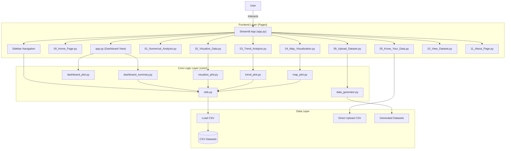
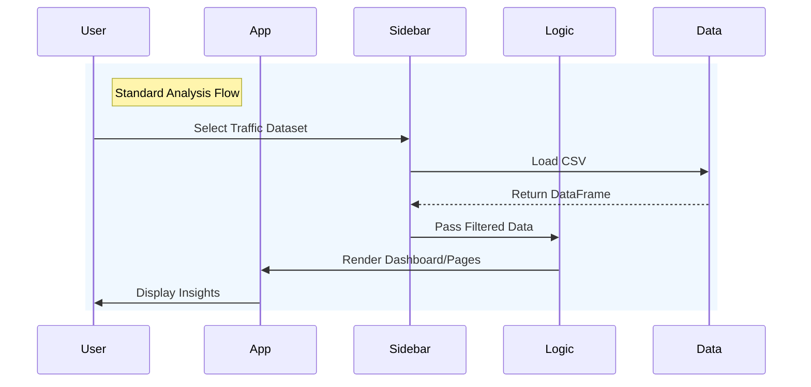
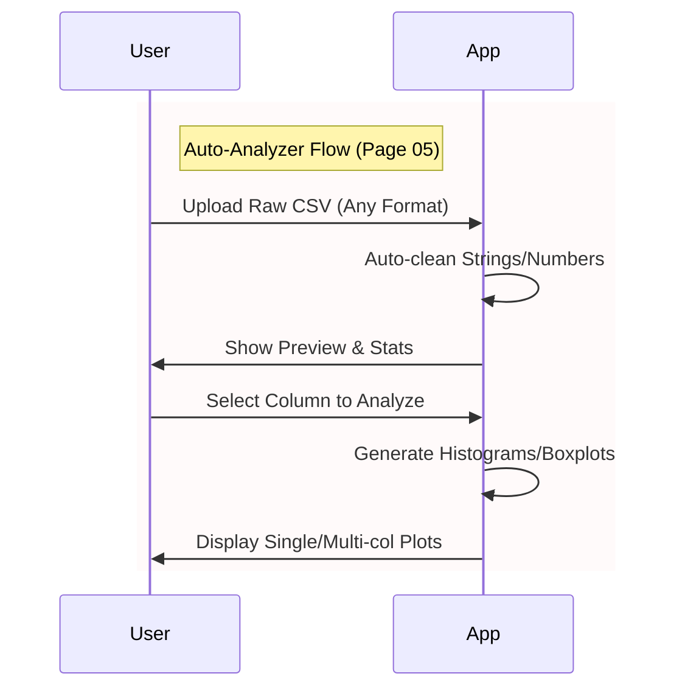
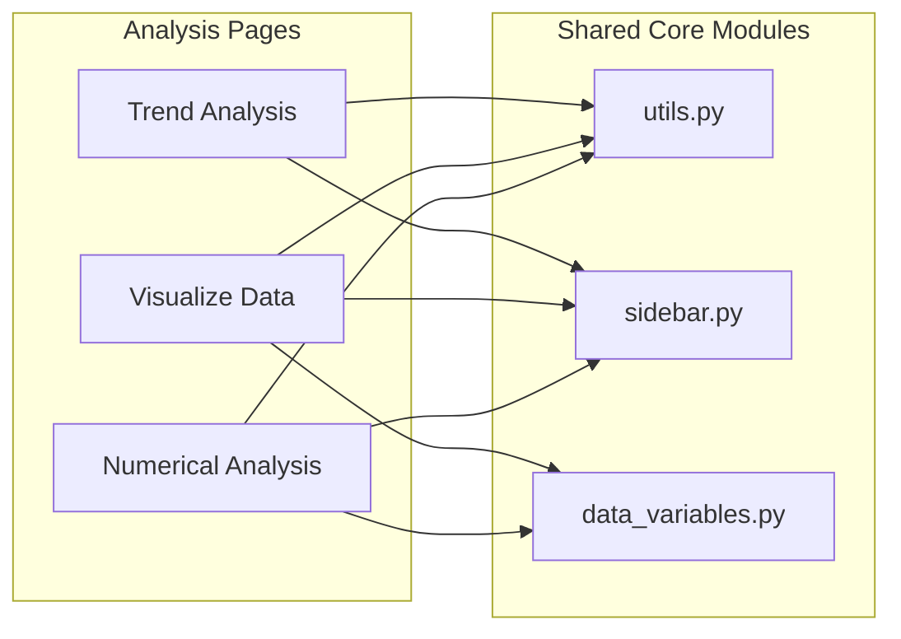

# 📊 PROJECT_BLUEPRINT_3: Visual Diagrams & Architecture

This document contains the visual representations of the **Smart Traffic Violation Pattern Detector Dashboard**, including high-level architecture, data flow sequences, and component interactions.

## 1. High-Level Architecture

The application follows a modular architecture where `app.py` serves as the entry point, orchestrating navigation between different pages. Core business logic, data processing, and plotting functions are decoupled into the `core/` directory.

## 2. Data Flow Sequence

This sequence describes how data flows from the user's interaction (selecting a dataset) through the processing layer to the final visualization.

### 2.1 Standard Analysis Flow

### 2.2 Auto-Analyzer Flow (Independent Upload)

## 3. Component Interaction Map

A refined view of how specific pages interact with core modules.

